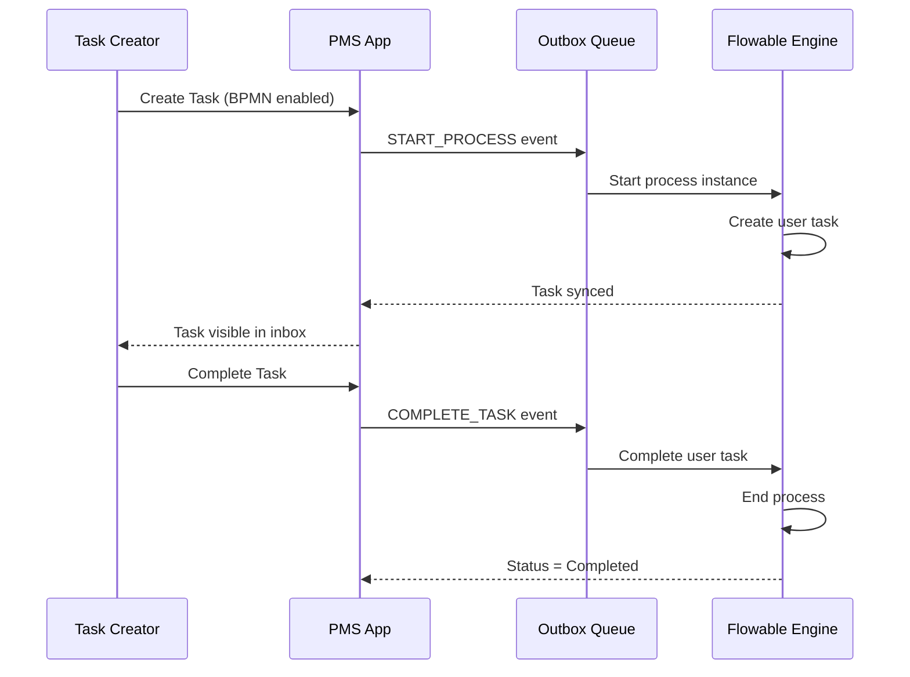
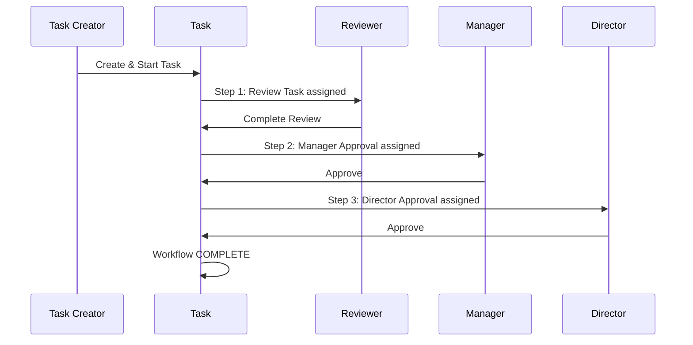
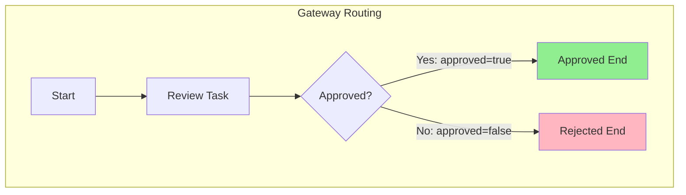
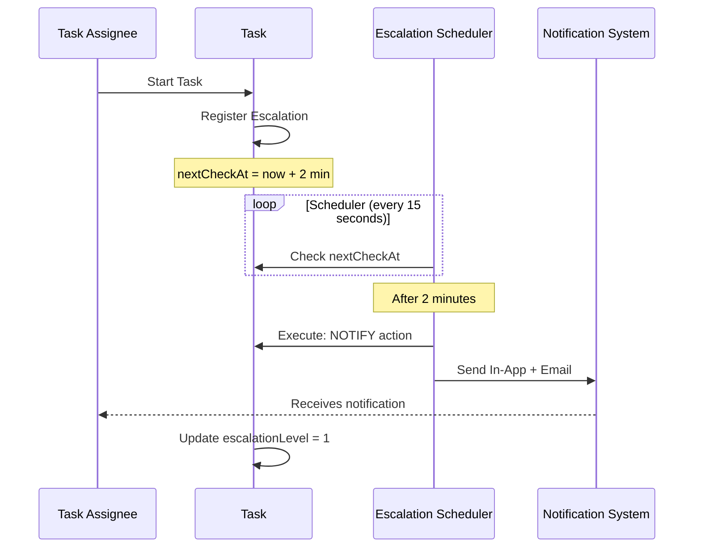
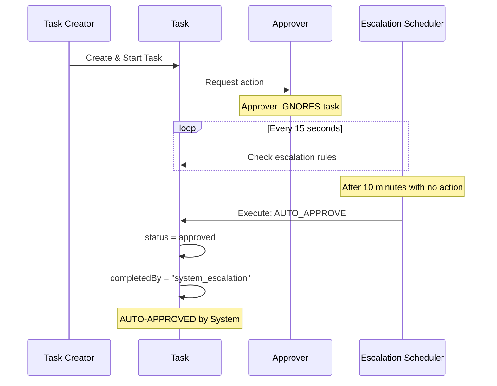
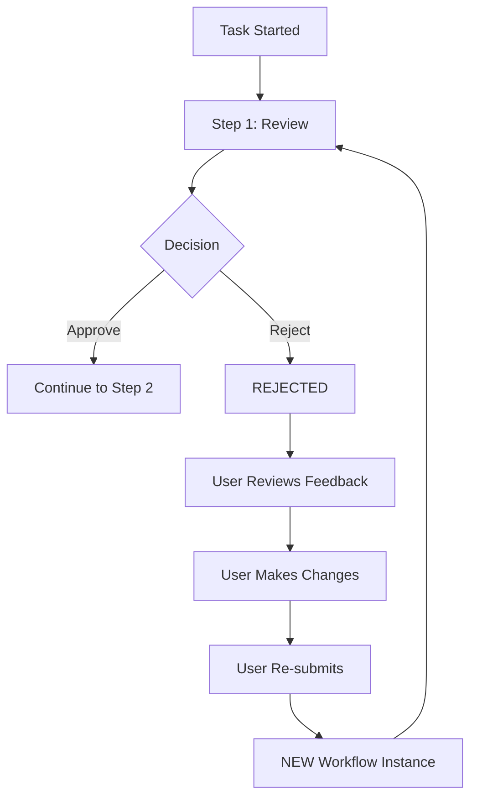
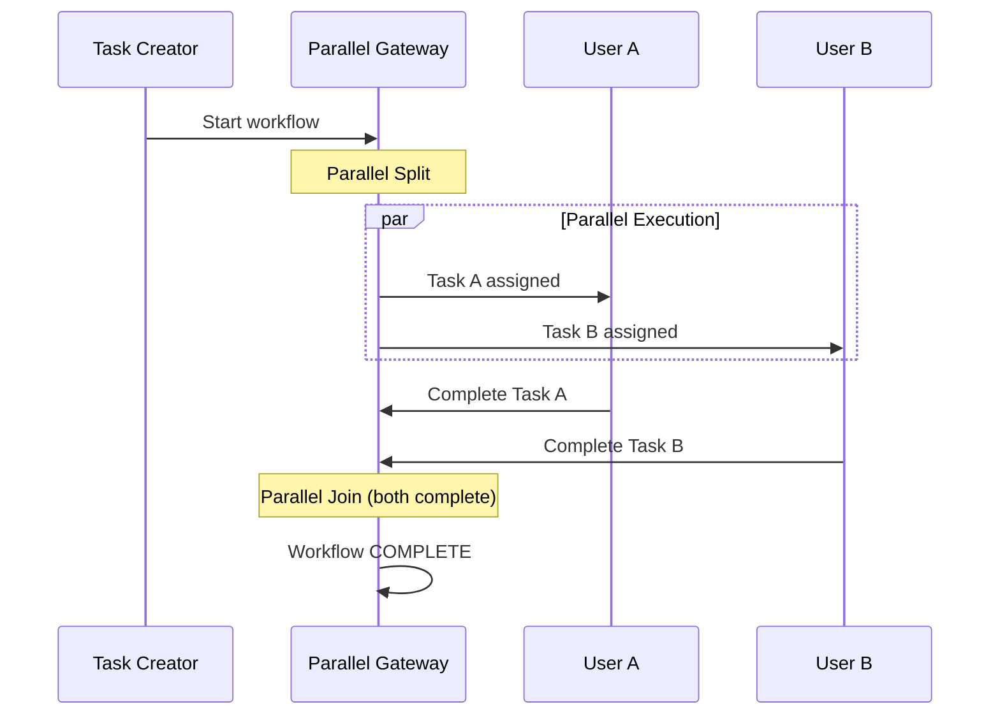

# BPMN Workflow Testing Scenarios Guide
## Complete Edge-to-Edge Testing for BPMN/Flowable Integration

---

## Table of Contents

1. [BPMN Architecture Overview](#1-bpmn-architecture-overview)
2. [Pre-Test Setup Requirements](#2-pre-test-setup-requirements)
3. [Test Workflow Definitions](#3-test-workflow-definitions)
4. [Escalation Policy Configurations](#4-escalation-policy-configurations)
5. [Test Scenarios Matrix](#5-test-scenarios-matrix)
6. [Scenario 1: Simple Single-Task Workflow](#6-scenario-1-simple-single-task-workflow)
7. [Scenario 2: Three-Step Sequential Approval](#7-scenario-2-three-step-sequential-approval)
8. [Scenario 3: Gateway Conditional Routing](#8-scenario-3-gateway-conditional-routing)
9. [Scenario 4: Time-Based Escalation](#9-scenario-4-time-based-escalation)
10. [Scenario 5: Multi-Level Progressive Escalation](#10-scenario-5-multi-level-progressive-escalation)
11. [Scenario 6: Auto-Approve via Escalation](#11-scenario-6-auto-approve-via-escalation)
12. [Scenario 7: Auto-Reject via Escalation](#12-scenario-7-auto-reject-via-escalation)
13. [Scenario 8: Rejection & Re-Submit Flow](#13-scenario-8-rejection--re-submit-flow)
14. [Scenario 9: Parallel Task Execution](#14-scenario-9-parallel-task-execution)
15. [Scenario 10: Retry & Dead Letter Queue](#15-scenario-10-retry--dead-letter-queue)
16. [Scenario 11: Backward Compatibility (Direct Tasks)](#16-scenario-11-backward-compatibility-direct-tasks)
17. [Scenario 12: Variable Passing Across Steps](#17-scenario-12-variable-passing-across-steps)
18. [Edge Cases & Error Scenarios](#18-edge-cases--error-scenarios)
19. [Performance Testing Checklist](#19-performance-testing-checklist)
20. [Quick Test Execution Summary](#20-quick-test-execution-summary)

---

## 1. BPMN Architecture Overview

### 1.1 System Components

```
┌─────────────────────────────────────────────────────────────────────────────┐
│                        BPMN WORKFLOW ARCHITECTURE                           │
├─────────────────────────────────────────────────────────────────────────────┤
│                                                                             │
│  ┌─────────────┐    ┌──────────────┐    ┌────────────────────┐              │
│  │   PMS App   │───▶│ Outbox Queue │───▶│ Flowable Engine    │              │
│  │  (Next.js)  │    │ (Firestore)  │    │ (REST API)         │              │
│  └─────────────┘    └──────────────┘    └────────────────────┘              │
│         │                   │                     │                         │
│         │                   ▼                     │                         │
│         │          ┌──────────────┐               │                         │
│         │          │   Outbox     │               │                         │
│         │          │  Processor   │◀──────────────┘                         │
│         │          │  (Functions) │                                         │
│         │          └──────────────┘                                         │
│         │                   │                                               │
│         ▼                   ▼                                               │
│  ┌─────────────────────────────────────────────────────────────┐            │
│  │                 BPMN Services Layer                          │            │
│  ├──────────────┬──────────────┬──────────────┬────────────────┤            │
│  │ Variable     │ Notification │ Resilience   │ Monitoring     │            │
│  │ Service      │ Service      │ Service      │ Service        │            │
│  └──────────────┴──────────────┴──────────────┴────────────────┘            │
│                                                                             │
└─────────────────────────────────────────────────────────────────────────────┘
```

### 1.2 Data Flow

```
┌──────────────────────────────────────────────────────────────────────────────┐
│                             TASK LIFECYCLE                                   │
├──────────────────────────────────────────────────────────────────────────────┤
│                                                                              │
│   User Action         │    Outbox Event      │    Flowable Action           │
│   ────────────────────│─────────────────────│──────────────────────────────│
│                       │                      │                              │
│   Create Task    ───▶ │  START_PROCESS  ───▶│  Start Process Instance      │
│                       │                      │  Create User Task            │
│                       │                      │                              │
│   Complete Task  ───▶ │  COMPLETE_TASK ───▶ │  Complete User Task          │
│                       │                      │  Advance to Next Step        │
│                       │                      │                              │
│   Set Variable   ───▶ │  SET_VARIABLE  ───▶ │  Set Process Variable        │
│                       │                      │                              │
│   Claim Task     ───▶ │  CLAIM_TASK    ───▶ │  Assign Task to User         │
│                       │                      │                              │
└──────────────────────────────────────────────────────────────────────────────┘
```

### 1.3 Key Collections (Firestore)

| Collection Path | Purpose |
|-----------------|---------|
| `companies/{cid}/bpmnWorkflows` | BPMN workflow definitions |
| `companies/{cid}/bpmnProcessInstances` | Running process instances |
| `companies/{cid}/tasks` | Tasks with BPMN integration |
| `companies/{cid}/outboxEvents` | Pending/processed events |
| `companies/{cid}/deadLetterQueue` | Failed events after retries |
| `companies/{cid}/escalationRegistrations` | Active escalation monitoring |

---

## 2. Pre-Test Setup Requirements

### 2.1 Required System Configuration

Before testing, ensure the following exists:

- [ ] **Flowable Server** running and accessible
- [ ] **BPMN Feature Flag** enabled for company
- [ ] **Test Workspace** created
- [ ] **Test Project** created with BPMN enabled
- [ ] **Test Users** with appropriate permissions

### 2.2 Create Test Project

Navigate: **Projects → Create Project**

| Field | Value |
|-------|-------|
| Name | `BPMN Workflow Testing` |
| Code | `BPMN-WFT` |
| Workspace | `Test Workspace` |
| Enable BPMN Workflows | **ON** |
| Default Workflow | `(To be set after creating workflows)` |

### 2.3 Test User Mapping

| Role | Email | Purpose |
|------|-------|---------|
| Task Creator | creator@company.com | Creates and submits tasks |
| Reviewer | reviewer@company.com | Reviews tasks in step 1 |
| Manager | manager@company.com | Approves tasks in step 2 |
| Director | director@company.com | Final approval in step 3 |
| Admin | admin@company.com | System administration |

---

## 3. Test Workflow Definitions

Navigate: **Workflows → BPMN Workflows → Click "New BPMN Workflow"**

Create these **6 Workflow Definitions** for comprehensive testing.

---

### WF-1: Simple Single-Task Workflow

#### Basic Info Tab
| Field | Value |
|-------|-------|
| Name* | `Simple Task Workflow` |
| Key | `simple-task` |
| Category | `testing` |
| Status | **Active** |
| Description | `Single task workflow for basic testing` |

#### BPMN Designer
Create this flow:
```
┌─────────┐     ┌─────────────┐     ┌─────────┐
│  Start  │────▶│  User Task  │────▶│   End   │
└─────────┘     └─────────────┘     └─────────┘
```

#### User Task Settings
| Field | Value |
|-------|-------|
| Task Name | `Complete Task` |
| Task ID | `task_1` |
| Assignee | `${initiator}` |
| Due Date | `PT24H` (24 hours) |

---

### WF-2: Three-Step Sequential Approval

#### Basic Info Tab
| Field | Value |
|-------|-------|
| Name* | `Three-Step Approval` |
| Key | `three-step-approval` |
| Category | `approval` |
| Status | **Active** |
| Description | `Sequential three-step approval workflow` |

#### BPMN Designer
```
┌───────┐   ┌──────────────┐   ┌──────────────┐   ┌──────────────┐   ┌─────┐
│ Start │──▶│ Review Task  │──▶│Manager Appr. │──▶│Director Appr.│──▶│ End │
└───────┘   └──────────────┘   └──────────────┘   └──────────────┘   └─────┘
```

#### Step 1: Review Task
| Field | Value |
|-------|-------|
| Task Name | `Initial Review` |
| Task ID | `step1_review` |
| Assignee Type | `Candidate Users` |
| Candidate Users | `reviewer@company.com` |
| Due Date | `PT4H` (4 hours) |

#### Step 2: Manager Approval
| Field | Value |
|-------|-------|
| Task Name | `Manager Approval` |
| Task ID | `step2_manager` |
| Assignee Type | `Candidate Users` |
| Candidate Users | `manager@company.com` |
| Due Date | `PT8H` (8 hours) |

#### Step 3: Director Approval
| Field | Value |
|-------|-------|
| Task Name | `Director Approval` |
| Task ID | `step3_director` |
| Assignee Type | `Candidate Users` |
| Candidate Users | `director@company.com` |
| Due Date | `PT8H` (8 hours) |

---

### WF-3: Approval with Gateway (Approve/Reject)

#### Basic Info Tab
| Field | Value |
|-------|-------|
| Name* | `Approval with Gateway` |
| Key | `approval-gateway` |
| Category | `approval` |
| Status | **Active** |
| Description | `Approval workflow with conditional routing` |

#### BPMN Designer
```
                          ┌──────────────────┐
                     YES  │  Approved End    │
                    ┌────▶│                  │
┌───────┐   ┌──────────────┐   ┌─────────────┐
│ Start │──▶│ Review Task  │──▶│  Gateway    │
└───────┘   └──────────────┘   │  Approved?  │
                               └─────────────┘
                    └────▶│  Rejected End    │
                      NO  │                  │
                          └──────────────────┘
```

#### Review Task
| Field | Value |
|-------|-------|
| Task Name | `Review and Decide` |
| Task ID | `review_task` |
| Assignee | `reviewer@company.com` |
| Form Fields | `approved (boolean)`, `comment (string)` |

#### Gateway Conditions
| Condition | Expression | Target |
|-----------|------------|--------|
| Approved | `${approved == true}` | `approved_end` |
| Rejected (Default) | `${approved == false}` | `rejected_end` |

---

### WF-4: Workflow with Quick Escalation (FOR TESTING)

#### Basic Info Tab
| Field | Value |
|-------|-------|
| Name* | `Quick Escalation Test` |
| Key | `quick-escalation` |
| Category | `testing` |
| Status | **Active** |
| Description | `Workflow with 2-minute escalation for testing` |

#### BPMN Designer
```
┌─────────┐     ┌─────────────────┐     ┌─────────┐
│  Start  │────▶│  Urgent Task    │────▶│   End   │
└─────────┘     │  (2 min due)    │     └─────────┘
                └─────────────────┘
```

#### User Task Settings
| Field | Value |
|-------|-------|
| Task Name | `Urgent Task` |
| Task ID | `urgent_task` |
| Assignee | `${initiator}` |
| Due Date | `PT2M` (2 minutes) |

#### Escalation Policy (Attach)
| Field | Value |
|-------|-------|
| Escalation Policy | `Quick Notify 2min` (EP-1) |

---

### WF-5: Parallel Tasks Workflow

#### Basic Info Tab
| Field | Value |
|-------|-------|
| Name* | `Parallel Tasks` |
| Key | `parallel-tasks` |
| Category | `testing` |
| Status | **Active** |
| Description | `Workflow with parallel task execution` |

#### BPMN Designer
```
                          ┌──────────────┐
                    ┌────▶│   Task A     │────┐
┌───────┐   ┌──────────────┐              ┌──────────────┐   ┌─────┐
│ Start │──▶│Parallel Split│              │Parallel Join │──▶│ End │
└───────┘   └──────────────┘              └──────────────┘   └─────┘
                    └────▶│   Task B     │────┘
                          └──────────────┘
```

#### Task A Settings
| Field | Value |
|-------|-------|
| Task Name | `Task A` |
| Task ID | `task_a` |
| Assignee | `user_a@company.com` |

#### Task B Settings
| Field | Value |
|-------|-------|
| Task Name | `Task B` |
| Task ID | `task_b` |
| Assignee | `user_b@company.com` |

---

### WF-6: Variable Passing Workflow

#### Basic Info Tab
| Field | Value |
|-------|-------|
| Name* | `Variable Passing Test` |
| Key | `variable-passing` |
| Category | `testing` |
| Status | **Active** |
| Description | `Test variable passing between steps` |

#### BPMN Designer
```
┌───────┐   ┌──────────────┐   ┌──────────────┐   ┌──────────────┐   ┌─────┐
│ Start │──▶│Set Variables │──▶│Read Variables│──▶│Final Check   │──▶│ End │
└───────┘   └──────────────┘   └──────────────┘   └──────────────┘   └─────┘
```

#### Step 1: Set Variables
| Field | Value |
|-------|-------|
| Task Name | `Set Variables` |
| Task ID | `set_vars` |
| Form Fields | `amount (number)`, `department (string)`, `approved (boolean)` |

#### Step 2: Read Variables
| Field | Value |
|-------|-------|
| Task Name | `Read Variables` |
| Task ID | `read_vars` |
| Form Fields | `(read-only display of ${amount}, ${department})` |

---

## 4. Escalation Policy Configurations

Navigate: **Workflows → Escalation Policies → Click "New Escalation Policy"**

Create these **6 Escalation Policies** with minimal time for quick testing.

---

### EP-1: Quick Notify (2 Minutes) - FOR TESTING

#### Basic Info
| Field | Value |
|-------|-------|
| Name* | `Quick Notify 2min` |
| Category | `testing` |
| Status | **Active** |
| Description | `Notify assignee after 2 minutes - FOR TESTING ONLY` |

#### Rules (Add 1 Rule)
| Rule | Field | Value |
|------|-------|-------|
| **Rule 1** | Name | `2-Min Reminder` |
| | Trigger Type | `Time-based` |
| | After | `2 minutes` OR `0.033 hours` |
| | Action | `Send notification` |
| | Channels | In-App: **ON**, Email: **ON** |
| | Message | `Task "{taskTitle}" needs attention` |

#### Settings
| Field | Value |
|-------|-------|
| Max Escalations | `1` |
| Final Action | `None` |

---

### EP-2: Escalate Up (5 Minutes)

#### Basic Info
| Field | Value |
|-------|-------|
| Name* | `Escalate Up 5min` |
| Category | `testing` |
| Status | **Active** |
| Description | `Escalate to manager after 5 minutes` |

#### Rules
| Rule | Field | Value |
|------|-------|-------|
| **Rule 1** | Name | `5-Min Escalate` |
| | After | `5 minutes` OR `0.083 hours` |
| | Action | `Escalate to next level` |
| | Target Level | `1` (next level up) |

#### Settings
| Field | Value |
|-------|-------|
| Max Escalations | `3` |
| Final Action | `Notify Admin` |

---

### EP-3: Progressive Escalation (5, 10, 15 min)

#### Basic Info
| Field | Value |
|-------|-------|
| Name* | `Progressive 5-10-15min` |
| Category | `testing` |
| Status | **Active** |
| Description | `Progressive escalation every 5 minutes through 3 levels` |

#### Rules (Add 3 Rules)
| Rule | Name | After | Action |
|------|------|-------|--------|
| **Rule 1** | `5-Min Notify` | `0.083 hrs` (5 min) | Send notification |
| **Rule 2** | `10-Min Escalate L1` | `0.167 hrs` (10 min) | Escalate to level 1 |
| **Rule 3** | `15-Min Escalate L2` | `0.25 hrs` (15 min) | Escalate to level 2 |

#### Settings
| Field | Value |
|-------|-------|
| Max Escalations | `3` |
| Final Action | `Notify Admin` |

---

### EP-4: Auto-Approve (10 Minutes)

#### Basic Info
| Field | Value |
|-------|-------|
| Name* | `Auto-Approve 10min` |
| Category | `auto-action` |
| Status | **Active** |
| Description | `Auto-approve if no action within 10 minutes` |

#### Rules
| Rule | Field | Value |
|------|-------|-------|
| **Rule 1** | Name | `10-Min Auto-Approve` |
| | After | `10 minutes` OR `0.167 hours` |
| | Action | `Auto approve` |
| | Message | `Task auto-approved due to no response` |

#### Settings
| Field | Value |
|-------|-------|
| Max Escalations | `1` |
| Final Action | `Auto approve` |
| Notify on Final Action | **ON** |

---

### EP-5: Auto-Reject (10 Minutes)

#### Basic Info
| Field | Value |
|-------|-------|
| Name* | `Auto-Reject 10min` |
| Category | `auto-action` |
| Status | **Active** |
| Description | `Auto-reject if no action within 10 minutes` |

#### Rules
| Rule | Field | Value |
|------|-------|-------|
| **Rule 1** | Name | `10-Min Auto-Reject` |
| | After | `10 minutes` OR `0.167 hours` |
| | Action | `Auto reject` |
| | Message | `Task auto-rejected due to no response` |

#### Settings
| Field | Value |
|-------|-------|
| Max Escalations | `1` |
| Final Action | `Auto reject` |

---

### EP-6: Reassign Escalation (5 Minutes)

#### Basic Info
| Field | Value |
|-------|-------|
| Name* | `Reassign 5min` |
| Category | `testing` |
| Status | **Active** |
| Description | `Reassign task to manager if no action in 5 minutes` |

#### Rules
| Rule | Field | Value |
|------|-------|-------|
| **Rule 1** | Name | `5-Min Reassign` |
| | After | `5 minutes` OR `0.083 hours` |
| | Action | `Reassign` |
| | Target | `Next level manager` |

---

### Time Conversion Reference

| Minutes | Hours Value | Notes |
|---------|-------------|-------|
| 2 min | `0.033` | Quick testing |
| 3 min | `0.05` | Quick testing |
| 5 min | `0.083` | Quick testing |
| 10 min | `0.167` | Quick testing |
| 15 min | `0.25` | Quick testing |
| 30 min | `0.5` | Production-like |
| 1 hour | `1.0` | Production-like |
| 4 hours | `4.0` | Standard SLA |

---

## 5. Test Scenarios Matrix

### Quick Reference: Minimal Time Tests

| # | Scenario Name | Workflow | Escalation | Wait Time | Duration |
|---|---------------|----------|------------|-----------|----------|
| 1 | Simple Single-Task | WF-1 | None | 0 min | **2 min** |
| 2 | Three-Step Sequential | WF-2 | None | 0 min | **5 min** |
| 3 | Gateway Routing | WF-3 | None | 0 min | **3 min** |
| 4 | Quick Escalation | WF-4 | EP-1 | 2 min | **5 min** |
| 5 | Progressive Escalation | WF-1 | EP-3 | 15 min | **18 min** |
| 6 | Auto-Approve | WF-2 | EP-4 | 10 min | **12 min** |
| 7 | Auto-Reject | WF-2 | EP-5 | 10 min | **12 min** |
| 8 | Rejection & Re-Submit | WF-3 | None | 0 min | **5 min** |
| 9 | Parallel Tasks | WF-5 | None | 0 min | **4 min** |
| 10 | Retry & DLQ | WF-1 | None | 0 min | **5 min** |
| 11 | Backward Compatibility | N/A | N/A | 0 min | **3 min** |
| 12 | Variable Passing | WF-6 | None | 0 min | **5 min** |

**Total Estimated Testing Time: ~80 minutes**

---

## 6. Scenario 1: Simple Single-Task Workflow

### 6.1 Flow Diagram



### 6.2 Test Steps

| Step | Actor | Action | Field/Value | Expected Result |
|------|-------|--------|-------------|-----------------|
| 1 | Creator | Login as `creator@company.com` | - | Dashboard loads |
| 2 | Creator | Navigate to Create Task | `/projects/bpmn-wft/tasks/new` | Form opens |
| 3 | Creator | Fill Title | `BPMN-S1: Simple Task Test` | Title entered |
| 4 | Creator | Fill Description | `Testing simple BPMN workflow` | Description entered |
| 5 | Creator | Select Workflow | `Simple Task Workflow` | WF-1 selected |
| 6 | Creator | Leave Escalation | `None` | No escalation |
| 7 | Creator | Click Create | - | Task created |
| 8 | System | **Verify** | Outbox Events tab | Shows `START_PROCESS` event |
| 9 | System | **Verify** | Task Detail | Shows `flowableTaskId` populated |
| 10 | System | **Verify** | Task Status | `status = in_progress` |
| 11 | Creator | Click Complete Task | - | Completion modal opens |
| 12 | Creator | Confirm Complete | - | Task completed |
| 13 | System | **Verify** | Outbox Events | Shows `COMPLETE_TASK` event |
| 14 | System | **Verify** | Task Status | `status = completed` |
| 15 | System | **Verify** | Process Instance | `status = completed` |

### 6.3 Verification Checklist

- [ ] Task created successfully with BPMN workflow
- [ ] `START_PROCESS` outbox event created
- [ ] Flowable process instance started
- [ ] `flowableTaskId` populated on task
- [ ] `COMPLETE_TASK` outbox event created
- [ ] Flowable task completed
- [ ] Process instance completed
- [ ] No errors in outbox events

---

## 7. Scenario 2: Three-Step Sequential Approval

### 7.1 Flow Diagram



### 7.2 Test Steps

| Step | Actor | Action | Expected Result |
|------|-------|--------|-----------------|
| 1 | Creator | Login as `creator@company.com` | Dashboard loads |
| 2 | Creator | Create task with `Three-Step Approval` workflow | Task created |
| 3 | System | **Verify** | Current step = `step1_review` |
| 4 | System | **Verify** | Reviewer receives notification |
| 5 | Reviewer | Login as `reviewer@company.com` | Dashboard loads |
| 6 | Reviewer | Check Task Inbox | Shows pending task |
| 7 | Reviewer | Open task | Task detail opens |
| 8 | Reviewer | Click Complete | Step 1 completed |
| 9 | System | **Verify** | Current step = `step2_manager` |
| 10 | System | **Verify** | Manager receives notification |
| 11 | Manager | Login as `manager@company.com` | Dashboard loads |
| 12 | Manager | Check Task Inbox | Shows pending task |
| 13 | Manager | Click Complete (Approve) | Step 2 completed |
| 14 | System | **Verify** | Current step = `step3_director` |
| 15 | Director | Login as `director@company.com` | Dashboard loads |
| 16 | Director | Click Complete (Approve) | Step 3 completed |
| 17 | System | **Verify** | Workflow status = `completed` |
| 18 | System | **Verify** | All 3 steps marked complete |

### 7.3 Verification Checklist

- [ ] Step 1 activates first
- [ ] Step 2 only activates after Step 1 complete
- [ ] Step 3 only activates after Step 2 complete
- [ ] Each assignee receives notification at correct time
- [ ] Workflow history shows all three steps
- [ ] Final status only set after all steps complete

---

## 8. Scenario 3: Gateway Conditional Routing

### 8.1 Flow Diagram



### 8.2 Test Steps - Approved Path

| Step | Actor | Action | Expected |
|------|-------|--------|----------|
| 1 | Creator | Create task with `Approval with Gateway` | Task created |
| 2 | Reviewer | Open task | See review form |
| 3 | Reviewer | Set `approved = true` | Checkbox checked |
| 4 | Reviewer | Add comment | `Approved - looks good` |
| 5 | Reviewer | Complete task | Task completed |
| 6 | System | **Verify Gateway Evaluation** | Condition `approved == true` matched |
| 7 | System | **Verify** | Routed to `approved_end` |
| 8 | System | **Verify** | Workflow status = `completed` |

### 8.3 Test Steps - Rejected Path

| Step | Actor | Action | Expected |
|------|-------|--------|----------|
| 1 | Creator | Create NEW task with `Approval with Gateway` | Task created |
| 2 | Reviewer | Open task | See review form |
| 3 | Reviewer | Set `approved = false` | Checkbox unchecked |
| 4 | Reviewer | Add comment | `Rejected - needs more info` |
| 5 | Reviewer | Complete task | Task completed |
| 6 | System | **Verify Gateway Evaluation** | Condition `approved == false` matched |
| 7 | System | **Verify** | Routed to `rejected_end` |
| 8 | System | **Verify** | Workflow status = `failed` (rejected) |

### 8.4 Verification Checklist

- [ ] Gateway evaluates conditions correctly
- [ ] `approved = true` routes to approved end
- [ ] `approved = false` routes to rejected end
- [ ] Default path used when no conditions match
- [ ] Condition evaluation logged in history

---

## 9. Scenario 4: Time-Based Escalation

### 9.1 Flow Diagram



### 9.2 Test Steps

| Step | Time | Actor | Action | Expected Result |
|------|------|-------|--------|-----------------|
| 1 | 0:00 | Creator | Create task with `Quick Escalation Test` workflow | Task created |
| 2 | 0:00 | Creator | Attach `Quick Notify 2min` escalation policy | Policy attached |
| 3 | 0:00 | Creator | Start task | Escalation registered |
| 4 | 0:00 | System | **Verify** | `escalationRegisteredAt` set |
| 5 | 0:00 | System | **Verify** | Next check shows ~2 min countdown |
| 6 | **~2:00** | Wait | Watch the clock... | - |
| 7 | 2:15 | System | **Verify** | Escalation level = 1 |
| 8 | 2:15 | Creator | Check notifications | New "Task Reminder" notification |
| 9 | 2:15 | Creator | Check email (if configured) | Reminder email received |
| 10 | Any | Creator | Complete task | Escalation monitoring stops |

### 9.3 Verification Checklist

- [ ] Escalation registered on task start
- [ ] `nextCheckAt` calculated correctly (2 minutes)
- [ ] Scheduler processed within 15-30 seconds of threshold
- [ ] In-app notification appears
- [ ] Email sent (if email channel configured)
- [ ] Escalation level incremented
- [ ] History shows escalation action
- [ ] Escalation stops after task completion

---

## 10. Scenario 5: Multi-Level Progressive Escalation

### 10.1 Test Configuration

| Setting | Value |
|---------|-------|
| Escalation Policy | `Progressive 5-10-15min` (EP-3) |
| Rule 1 | Notify at 5 minutes |
| Rule 2 | Escalate L1 at 10 minutes |
| Rule 3 | Escalate L2 at 15 minutes |

### 10.2 Test Steps

| Step | Time | Action | Expected |
|------|------|--------|----------|
| 1 | 0:00 | Create & start task with EP-3 | Escalation registered |
| 2 | 0:00 | **DO NOT complete task** | Wait for escalations |
| 3 | ~5:00 | Wait | Level 1: Notification sent |
| 4 | 5:00 | **Verify** | In-app notification received |
| 5 | ~10:00 | Wait | Level 2: Escalated to manager |
| 6 | 10:00 | **Verify** | Manager receives notification |
| 7 | ~15:00 | Wait | Level 3: Escalated to director |
| 8 | 15:00 | **Verify** | Director receives notification |
| 9 | 15:00 | **Verify** | Task shows escalationLevel = 3 |

### 10.3 Verification Checklist

- [ ] All three escalation levels triggered
- [ ] Each level triggers at correct time (+/- 30 seconds)
- [ ] Notifications sent to correct recipients at each level
- [ ] Escalation history shows all three actions
- [ ] Task assignee changes at reassignment levels (if configured)

---

## 11. Scenario 6: Auto-Approve via Escalation

### 11.1 Flow Diagram



### 11.2 Test Steps

| Step | Time | Action | Expected |
|------|------|--------|----------|
| 1 | 0:00 | Create task with `Three-Step Approval` workflow | Task created |
| 2 | 0:00 | Attach `Auto-Approve 10min` escalation policy | Policy attached |
| 3 | 0:00 | Start task | Step 1 assigned to Reviewer |
| 4 | 0:00-10:00 | **DO NOTHING** | Wait 10 minutes |
| 5 | ~10:15 | **Verify** | Task auto-approved by system |
| 6 | 10:15 | Check task detail | `completedBy = system_escalation` |
| 7 | 10:15 | Check comments | "Auto-approved by escalation policy" |
| 8 | 10:15 | Check notifications | Auto-approval notification sent |

### 11.3 Verification Checklist

- [ ] Task auto-approved without human action
- [ ] `completedBy` shows "system_escalation"
- [ ] Automatic comment added explaining auto-approval
- [ ] Notifications sent for auto-decision
- [ ] Escalation history shows AUTO_APPROVE action
- [ ] Workflow continues to next step (if applicable)

---

## 12. Scenario 7: Auto-Reject via Escalation

### 12.1 Test Steps

| Step | Time | Action | Expected |
|------|------|--------|----------|
| 1 | 0:00 | Create task with workflow | Task created |
| 2 | 0:00 | Attach `Auto-Reject 10min` escalation policy | Policy attached |
| 3 | 0:00 | Start task | Task in progress |
| 4 | 0:00-10:00 | **DO NOTHING** | Wait 10 minutes |
| 5 | ~10:15 | **Verify** | Task auto-rejected by system |
| 6 | 10:15 | Check task detail | `status = rejected` |
| 7 | 10:15 | Check comments | "Auto-rejected by escalation policy" |

### 12.2 Verification Checklist

- [ ] Task auto-rejected without human action
- [ ] Workflow status = `failed`
- [ ] Rejection reason recorded
- [ ] Notifications sent
- [ ] Escalation history shows AUTO_REJECT action

---

## 13. Scenario 8: Rejection & Re-Submit Flow

### 13.1 Flow Diagram



### 13.2 Test Steps

| Step | Actor | Action | Expected |
|------|-------|--------|----------|
| 1 | Creator | Create & start task with WF-3 | Task ready for review |
| 2 | Reviewer | Open task | See review form |
| 3 | Reviewer | Set `approved = false` | Rejection selected |
| 4 | Reviewer | Add comment | "Missing documentation, please add" |
| 5 | Reviewer | Complete (Reject) | Task rejected |
| 6 | System | **Verify** | Workflow status = `failed` |
| 7 | Creator | Check notifications | "Task rejected" notification |
| 8 | Creator | Open task | See rejection comment |
| 9 | Creator | Edit task | Add missing documentation |
| 10 | Creator | Click **Re-submit** | New workflow instance started |
| 11 | System | **Verify** | OLD instance = rejected |
| 12 | System | **Verify** | NEW instance = in_progress |
| 13 | Reviewer | Check inbox | New review request |
| 14 | Reviewer | Approve this time | Task approved |

### 13.3 Verification Checklist

- [ ] Original workflow instance marked as rejected/failed
- [ ] Rejection reason/comment captured
- [ ] Task can be edited after rejection
- [ ] Re-submit creates NEW workflow instance
- [ ] Old instance preserved for audit
- [ ] New instance shows as pending for reviewer
- [ ] Workflow history shows both instances

---

## 14. Scenario 9: Parallel Task Execution

### 14.1 Flow Diagram



### 14.2 Test Steps

| Step | Actor | Action | Expected |
|------|-------|--------|----------|
| 1 | Creator | Create task with `Parallel Tasks` workflow | Task created |
| 2 | System | **Verify** | Both Task A and Task B created |
| 3 | System | **Verify** | User A receives notification |
| 4 | System | **Verify** | User B receives notification |
| 5 | User A | Complete Task A | Task A = completed |
| 6 | System | **Verify** | Workflow still in progress |
| 7 | User B | Complete Task B | Task B = completed |
| 8 | System | **Verify** | Both parallel tasks complete |
| 9 | System | **Verify** | Workflow joins and completes |

### 14.3 Verification Checklist

- [ ] Both parallel tasks created simultaneously
- [ ] Both users notified at same time
- [ ] Tasks can be completed in any order
- [ ] Workflow waits for BOTH tasks to complete
- [ ] Parallel join activates after all parallel tasks done
- [ ] Workflow completes after join

---

## 15. Scenario 10: Retry & Dead Letter Queue

### 15.1 Test Purpose

Test the resilience of the outbox processor when Flowable is unavailable.

### 15.2 Test Steps (Simulated Flowable Failure)

| Step | Action | Expected |
|------|--------|----------|
| 1 | **Stop Flowable server** (or mock failure) | Flowable unavailable |
| 2 | Create & start task | Task created, START_PROCESS event queued |
| 3 | **Verify** Outbox Event | Status = `pending`, retryCount = 0 |
| 4 | Wait for retry attempt | RetryCount increments |
| 5 | **Verify** | Exponential backoff applied |
| 6 | After 3 retries | Event moves to Dead Letter Queue |
| 7 | **Start Flowable server** | Flowable available again |
| 8 | Manually retry DLQ event | Event processed successfully |
| 9 | **Verify** | Task now synced with Flowable |

### 15.3 Verification Checklist

- [ ] Events retry with exponential backoff
- [ ] Retry count tracked correctly
- [ ] Events move to DLQ after max retries
- [ ] DLQ events preserve original payload
- [ ] Manual retry from DLQ works
- [ ] Circuit breaker opens on repeated failures
- [ ] Circuit breaker allows probe requests in half-open state

---

## 16. Scenario 11: Backward Compatibility (Direct Tasks)

### 16.1 Test Purpose

Verify that existing Direct Execution (non-BPMN) tasks continue to work.

### 16.2 Test Steps

| Step | Action | Expected |
|------|--------|----------|
| 1 | Navigate to Create Task | Form opens |
| 2 | Fill Title | `Direct Task Test` |
| 3 | **Leave BPMN Workflow empty** | No workflow selected |
| 4 | Leave Escalation empty | No escalation |
| 5 | Click Create | Task created |
| 6 | **Verify** | No `flowableTaskId` |
| 7 | **Verify** | No `processInstanceId` |
| 8 | **Verify** | No outbox events created |
| 9 | Change status manually | Works like before |
| 10 | Complete task manually | Works like before |

### 16.3 Coexistence Test

| Step | Action | Expected |
|------|--------|----------|
| 1 | Create Direct Task (no workflow) | Direct task created |
| 2 | Create BPMN Task (with workflow) | BPMN task created |
| 3 | **Verify** both exist in task list | Both visible |
| 4 | Complete Direct Task manually | Works |
| 5 | Complete BPMN Task via workflow | Works |
| 6 | **Verify** no interference | Both independent |

### 16.4 Verification Checklist

- [ ] Direct tasks (no workflow) still work
- [ ] No Flowable sync for direct tasks
- [ ] No outbox events for direct tasks
- [ ] BPMN and direct tasks coexist
- [ ] No interference between modes
- [ ] Existing direct task functionality unchanged

---

## 17. Scenario 12: Variable Passing Across Steps

### 17.1 Test Purpose

Verify that variables set in one step are available in subsequent steps.

### 17.2 Test Steps

| Step | Actor | Action | Expected |
|------|-------|--------|----------|
| 1 | Creator | Create task with `Variable Passing Test` workflow | Task created |
| 2 | User | Open Step 1 (Set Variables) | Form with input fields |
| 3 | User | Enter `amount = 50000` | Value entered |
| 4 | User | Enter `department = Engineering` | Value entered |
| 5 | User | Enter `approved = true` | Value entered |
| 6 | User | Complete Step 1 | Variables saved |
| 7 | User | Open Step 2 (Read Variables) | Form with read-only fields |
| 8 | **Verify** | `amount` shows `50000` |
| 9 | **Verify** | `department` shows `Engineering` |
| 10 | User | Complete Step 2 | Continue to final |
| 11 | User | Complete Final Check | Workflow complete |
| 12 | **Verify** | All variables preserved in history |

### 17.3 Verification Checklist

- [ ] Variables set in Step 1 available in Step 2
- [ ] Variable types preserved (number, string, boolean)
- [ ] Variables available in gateway conditions
- [ ] Variables included in workflow history
- [ ] Variables accessible via API

---

## 18. Edge Cases & Error Scenarios

### EC-1: Task Without Assignee

| Step | Action | Expected |
|------|--------|----------|
| 1 | Create task with NO assignee | Task created |
| 2 | Select BPMN Workflow | Workflow attached |
| 3 | Try to start workflow | Should WARN (no assignee) |
| 4 | Assign user | Assignee set |
| 5 | Start workflow | Works now |

### EC-2: Change Workflow Mid-Flight

| Step | Action | Expected |
|------|--------|----------|
| 1 | Create task with WF-1 | Task created |
| 2 | Start workflow | Process instance created |
| 3 | Try to change workflow | **Should be DISABLED** |
| 4 | Complete workflow | Workflow done |
| 5 | Try to start new workflow | **Should allow** new instance |

### EC-3: Flowable Task ID Mismatch

| Step | Action | Expected |
|------|--------|----------|
| 1 | Create BPMN task | Task with flowableTaskId |
| 2 | Manually delete Flowable task | Task missing in Flowable |
| 3 | Try to complete PMS task | Error: task not found |
| 4 | System should | Create new Flowable task OR flag error |

### EC-4: Duplicate START_PROCESS Events

| Step | Action | Expected |
|------|--------|----------|
| 1 | Create outbox event manually | START_PROCESS created |
| 2 | Duplicate event (same payload) | Second event created |
| 3 | Process both | Should be idempotent |
| 4 | **Verify** | Only ONE process instance created |

### EC-5: Gateway with Missing Variable

| Step | Action | Expected |
|------|--------|----------|
| 1 | Create task with WF-3 | Gateway workflow |
| 2 | Complete without setting `approved` | Variable missing |
| 3 | Gateway evaluation | Should use DEFAULT path |
| 4 | **Verify** | Routed to rejected end (default) |

### EC-6: Circular Workflow (Error Case)

| Step | Action | Expected |
|------|--------|----------|
| 1 | Try to create workflow with loop | Designer validates |
| 2 | If infinite loop possible | System detects |
| 3 | Execution with loop | Max iterations limit |

### EC-7: Large Variable Payload

| Step | Action | Expected |
|------|--------|----------|
| 1 | Set variable with large JSON object | Variable set |
| 2 | **Verify** size limits | Follows Firestore limits |
| 3 | Complete task | Variables synced to Flowable |

### EC-8: Concurrent Task Completion

| Step | Action | Expected |
|------|--------|----------|
| 1 | Two users open same task | Both see task |
| 2 | Both click Complete simultaneously | Race condition |
| 3 | System should | Only ONE completion succeeds |
| 4 | **Verify** | Second user sees "already completed" |

---

## 19. Performance Testing Checklist

### 19.1 Load Testing

| Test | Parameters | Expected |
|------|------------|----------|
| Bulk task creation | 100 BPMN tasks created simultaneously | All START_PROCESS events processed < 30 sec |
| Bulk task completion | 50 tasks completed simultaneously | All COMPLETE_TASK events processed < 15 sec |
| Outbox processing rate | 1000 pending events | Processed within 2 minutes |
| Escalation scheduler load | 500 active escalations | Scheduler completes < 30 sec |

### 19.2 Concurrency Testing

| Test | Scenario | Expected |
|------|----------|----------|
| Parallel task completion | 2 users complete same task | Only 1 succeeds |
| Outbox race condition | 2 processors pick same event | Only 1 processes |
| Variable update race | Concurrent variable updates | Last write wins |

### 19.3 Resilience Testing

| Test | Scenario | Expected |
|------|----------|----------|
| Flowable down | Outbox events queue | Events retry with backoff |
| Flowable slow | Response > 30 seconds | Timeout and retry |
| Network partition | Intermittent connectivity | Circuit breaker activates |
| Recovery after outage | Flowable returns | DLQ events replayable |

---

## 20. Quick Test Execution Summary

### 20.1 5-Minute Smoke Test

Run these tests to verify core functionality in 5 minutes:

1. Create task with `Simple Task Workflow` → Complete → Verify Flowable sync
2. Create task with `Quick Notify 2min` → Start → Wait 2 min → See notification
3. Create Direct task (no workflow) → Verify no Flowable interaction

### 20.2 Full Regression Test Order

Execute in this order for complete coverage:

| Order | Scenario | Duration | Cumulative |
|-------|----------|----------|------------|
| 1 | Simple Single-Task (S1) | 2 min | 2 min |
| 2 | Quick Escalation (S4) | 5 min | 7 min |
| 3 | Three-Step Sequential (S2) | 5 min | 12 min |
| 4 | Gateway Routing (S3) | 3 min | 15 min |
| 5 | Rejection & Re-Submit (S8) | 5 min | 20 min |
| 6 | Progressive Escalation (S5) | 18 min | 38 min |
| 7 | Auto-Approve (S6) | 12 min | 50 min |
| 8 | Auto-Reject (S7) | 12 min | 62 min |
| 9 | Parallel Tasks (S9) | 4 min | 66 min |
| 10 | Backward Compatibility (S11) | 3 min | 69 min |
| 11 | Variable Passing (S12) | 5 min | 74 min |
| 12 | Edge Cases (EC1-8) | 20 min | 94 min |

**Total: ~95 minutes for complete coverage**

### 20.3 Daily Sanity Check

Run these 3 tests daily (< 10 min):

1. Simple BPMN task flow (create → start → complete)
2. 2-minute escalation fires correctly
3. Direct task (no workflow) still works

---

## Appendix A: Firestore Collections Reference

| Collection Path | Purpose |
|-----------------|---------|
| `companies/{cid}/bpmnWorkflows` | BPMN workflow definitions |
| `companies/{cid}/bpmnProcessInstances` | Running process instances |
| `companies/{cid}/tasks` | Tasks with optional BPMN |
| `companies/{cid}/outboxEvents` | Pending/processed outbox events |
| `companies/{cid}/deadLetterQueue` | Failed events after max retries |
| `companies/{cid}/escalationRegistrations` | Active escalation monitoring |
| `companies/{cid}/escalationHistory` | Historical escalation actions |

---

## Appendix B: Outbox Event Types

| Event Type | Trigger | Flowable Action |
|------------|---------|-----------------|
| `START_PROCESS` | Task created with BPMN workflow | Start process instance |
| `COMPLETE_TASK` | User completes task | Complete Flowable task |
| `CLAIM_TASK` | User claims/assigns task | Claim Flowable task |
| `UNCLAIM_TASK` | Task unassigned | Unclaim Flowable task |
| `SET_VARIABLE` | Variable set on task | Set process variable |
| `DELETE_VARIABLE` | Variable deleted | Delete process variable |
| `SIGNAL_EVENT` | Signal sent | Signal Flowable event |

---

## Appendix C: ISO Duration Format Reference

| Duration | ISO Format | Example Use |
|----------|------------|-------------|
| 2 minutes | `PT2M` | Quick testing |
| 5 minutes | `PT5M` | Quick testing |
| 30 minutes | `PT30M` | Short SLA |
| 1 hour | `PT1H` | Standard SLA |
| 4 hours | `PT4H` | Medium SLA |
| 24 hours | `P1D` or `PT24H` | Daily deadline |
| 3 days | `P3D` | Extended deadline |

---

## Appendix D: Gateway Condition Syntax

| Condition | Syntax | Example |
|-----------|--------|---------|
| Equality | `${var == value}` | `${approved == true}` |
| Inequality | `${var != value}` | `${status != 'rejected'}` |
| Greater than | `${var > value}` | `${amount > 10000}` |
| Less than | `${var < value}` | `${priority < 3}` |
| AND | `${cond1 && cond2}` | `${approved && amount > 0}` |
| OR | `${cond1 \|\| cond2}` | `${urgent \|\| priority == 1}` |

---

*Document Version: 1.0*
*Based on: BPMN/Flowable Integration*
*Last Updated: 2026-01-14*
*Designed for: Manual Testing with Minimal Wait Times*
